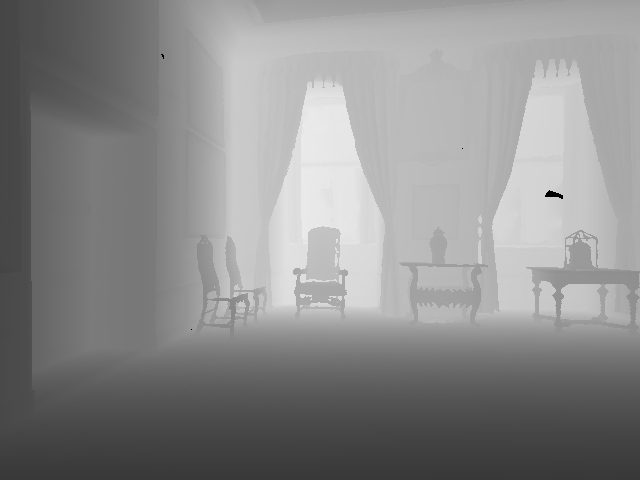
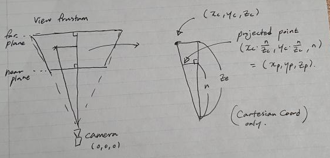
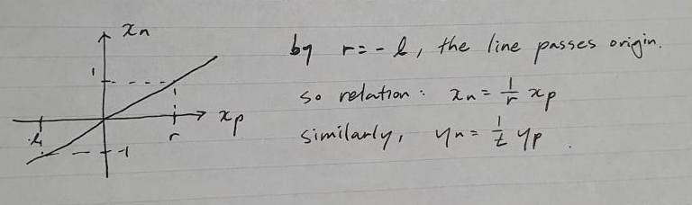

> Currently working on migrating to Python!

## How to run
Run 
```
builder.m
```
on matlab, no parameter required.

There are 2 script files:
- `builder.m` : Calls image2points and plots the result
- `image2points.m` : script that does the actual reconstruction

And input files:
- `habitat-img/*` : Habitat output depth image files, generated using examples.py from Habitat Sim (only 50 entries)
- `parsedOutput.csv` : Contains (x, y, z, qa, qb, qc, qd) data from habitat output (only 50 entries)

Data files not used in code, but is uploaded to repo:
- `testOutput.txt` : Contains habitat output

---

# 3d-reconstruction
## Samples -> NDC coord
[]()

Samples from habitat are obtained as images: (row j, col i, depth)

For any pixel in image, we can get coordinates

$$NDC \ Coords: 
\begin{bmatrix} 
x_n \\ 
y_n \\ 
z_n 
\end{bmatrix}
\ , \ \ x_n, y_n \in [-1, 1] \ , \ \ z_n \in [0, 1]$$

Where x: right, y: up, z: towards screen and camera located at (0, 0, 0).

Code:
```matlab
% Sampling pixel (i, j) from image im
% 1 <= i <= w, 1 <= j <= h, 0 <= im(j, i) <= 1.0
x_n(count) = (i - w/2) / w;
y_n(count) = ((-1)*j + h/2)/h;
z_n(count) = im(j, i);
```

#### Downsampling & Stepsize
For fast computation the images are downsampled:
```
% Downsampling using stepSize parameter
count = 0;
x_n = [];
y_n = [];
z_n = [];
for i=1:stepSize:w
	for j=1:stepSize:h
		if (im(j, i) < 0.15 || im(j, i) > 0.85), continue; end
		count = count + 1;
		x_n(count) = (i - w/2)/w;
		y_n(count) = ((-1)*j + h/2)/h;
		z_n(count) = im(j, i);
	end
end
NDC = [x_n; y_n; z_n];
```

## Intrinsics
#### Input from Habitat: width, height, near, far, hfov
Near: 0.01, Far: 1000.0
- Near, Far: float
	- [CameraSensor Class doc](https://aihabitat.org/docs/habitat-sim/habitat_sim.sensor.CameraSensor.html)
	- Hard coded in `src/esp/sensor/VisualSensor.h` : [here](https://github.com/facebookresearch/habitat-sim/blob/ec81c8cfe50b35f98edc4a390ee9b46a961b7144/src/esp/sensor/VisualSensor.h#:~:text=*/-,float%20near%20%3D%200.01f%3B,*/,-Mn%3A%3AColor4%20clearColor)
		- near: 0.01, far: 1000.0

hfov: 90 (degrees)
- hfov: degree
	- from `settings.py`

width, height: 640, 480
	- from `settings.py`

#### Near plane size (screen x, y-length)
screen x-length : $sx =  2 \cdot near \cdot tan(\large\frac{hfov}{2})$

screen y-length: $sy = sx \cdot \large\frac{resolution_x}{resolution_y}$ where resolution: width, height.

[]()

```MATLAB
width = 640; height = 480;
near = 0.01; far = 1000.0; hfov = 90*(2*PI/180);
s_x = 2 * near * tan(hfov/2);
s_y = s_x * width/height;
```

#### Near plane top/bottom/right/left
top: sy/2, bottom: -sy/2, right: sx/2, left: -sx/2

Code:
```matlab
near = 0.01; far = 1000.0;
[h, w] = size(im);
hfov = 90*(2*pi/360);
s_x = 2 * near * tan(hfov/2);
s_y = s_x * h/w;
r = s_x/2;
t = s_y/2;
```

## Extrinsics
Code to parse habitat output log to csv: [Parse output to csv](['Parse output to csv.md'](https://github.com/havocado/3d-reconstruction/blob/hailey/init/Parse%20output%20to%20csv.md))

(nothing special with this code, just reading habitat output and parsing into csv file)

Outputs 3 values for location and 4 values for rotation quaternion.

#### Modifying camera location
Our code: 
- x: right, y: up, z: towards screen

Habitat output:
- x: towards screen, y: up, z: right

#### Modifying quaternion

[]()

Hence
```matlab
modifiedCameraPos = [extrinsics(i,3); extrinsics(i,2); extrinsics(i,1)]';
modifiedQuaternion = [extrinsics(i,4); (-1)*extrinsics(i,7); extrinsics(i,6); (-1)*extrinsics(i,5)]';
```

# Unprojection
#### Unprojection input
near, far, top, right
samples
- x: right, y: up, z: towards screen, camera placed at (0,0,0)
 
#### Unprojection output (goal)
x, y, z in camera coord.
- x: Camera right, y: Camera up, z: Camera front direction, camera placed at (0,0,0)

#### Formulation
Define coordinates in Camera and NDC:

$$Output = Camera: \begin{bmatrix} 
x_c \\ 
y_c \\ 
z_c 
\end{bmatrix}
, \ \ Input = NDC: 
\begin{bmatrix} 
x_n \\ 
y_n \\ 
z_n 
\end{bmatrix}$$ 

Here Camera is located at the origin for both coordinates, z_c > 0.
For NDC, $x_n, y_n \in [-1, 1] , z_n \in [0, 1]$ where x points right, y points up, and z points toward the screen. (Left-handed coord system)

##### Camera -> NDC direction
Let's define a homogeneous coord version of NDC:

$$\begin{bmatrix} 
x_n \\ 
y_n \\ 
z_n 
\end{bmatrix}
\equiv
\begin{bmatrix} 
x_n' \\ 
y_n' \\ 
z_n' \\ 
w_n'
\end{bmatrix} 
= ProjMat \cdot
\begin{bmatrix} 
x_c \\ 
y_c \\ 
z_c \\ 
1
\end{bmatrix}
\ , \ \ w_n' = z_c$$

where $\equiv$ 
represents equivalence in homogeneous coordinates and $=$ represents element-wise equality of vectors. Reason for choice of $w_n'$ is in the construction of ProjMat.

##### Perspective Projection on near Plane
As a step for constructing ProjMat
Let's define Proj on near plane: homog coord equivalent to NDC where z_p is equal to n (z_p = n > 0).

By drawing triangles

[]()

we get the relation

$$\begin{bmatrix} 
x_p \\ 
y_p \\ 
z_p \\ 
w_p
\end{bmatrix} =
\begin{bmatrix} 
x_c \cdot (\frac{n}{z_c}) \\ 
y_c \cdot (\frac{n}{z_c}) \\ 
n \\ 
(\frac{n}{z_c})
\end{bmatrix} =
\begin{bmatrix} 
x_c \\ 
y_c \\ 
z_c \\ 1
\end{bmatrix} \cdot (\frac{n}{z_c})
\ \ \ \ \ \ \ \ \ \ \ \ (1)$$

(Note that z_c varies for each points)


Since we chose $x_n, y_n \in [-1, 1] , z_n \in [0, 1]$, we need a proper projection matrix.

[]()

we get the relation

$$
x_n = \frac{1}{r} \cdot x_p \ , \ \ \ y_n = \frac{1}{t} \cdot y_p
\ \ \ \ \ \ \ \ \ \ \ \ (2)
$$

Substituting (1) for (2), we get

$$
x_n = \frac{1}{r} \cdot (\frac{n}{z_c}) \cdot x_c \ , \ \ \ 
y_n = \frac{1}{r} \cdot (\frac{n}{z_c}) \cdot y_c
\ \ \ \ \ \ \ \ \ \ \ \ (3)
$$

We need a way to divide x_n and y_n by z_c, so we decide to use homogeneous coordinates and set the w_n' term equal to z_c.
The resulting projection matrix would be:


$$
\begin{bmatrix} 
x_n \\ 
y_n \\ 
z_n 
\end{bmatrix}
\equiv
\begin{bmatrix} 
x_n' \\ 
y_n' \\ 
z_n' \\ 
w_n'
\end{bmatrix} = 
\begin{bmatrix}
\frac{n}{r} & 0 & 0 & 0 \\
0 & \frac{n}{t} & 0 & 0 \\
? & ? & ? & ? \\
0 & 0 & 1 & 0
\end{bmatrix}
\begin{bmatrix} 
x_c \\ 
y_c \\ 
z_c \\ 
1
\end{bmatrix}
\ , \ \ w_n' = z_c
$$

z_n' term: We know that z_n' doesn't depend on x_c or y_c, so we can set the corresponding elements in the matrix to 0.

$$
\begin{bmatrix} 
x_n \\ 
y_n \\ 
z_n 
\end{bmatrix}
\equiv
\begin{bmatrix} 
x_n' \\ 
y_n' \\ 
z_n' \\ 
w_n'
\end{bmatrix} = 
\begin{bmatrix}
\frac{n}{r} & 0 & 0 & 0 \\
0 & \frac{n}{t} & 0 & 0 \\
0 & 0 & A & B \\
0 & 0 & 1 & 0
\end{bmatrix}
\begin{bmatrix} 
x_c \\ 
y_c \\ 
z_c \\ 
1
\end{bmatrix}
$$

Solving for A and B:
By projection matrix,

$$
z_n = \frac{z_n'}{w_n'} = \frac{A \cdot z_c + B}{z_c}
$$

As we decide to map $z_c \in [n, f]$ to $z_n \in [0, 1]$ linearly, we can obtain the relation as

$$
0 = \frac{A \cdot n + B}{n} \ , \ \ 1 = \frac{A \cdot f + B}{f}
$$

Gives us the result

$$
A = \frac{f}{f-n} \ , \ \ B = -\frac{nf}{f-n}
$$

So we can complete the projection matrix

$$
\begin{bmatrix} 
x_n \\ 
y_n \\ 
z_n 
\end{bmatrix}
\equiv
\begin{bmatrix} 
x_n' \\ 
y_n' \\ 
z_n' \\ 
w_n'
\end{bmatrix} = 
\begin{bmatrix}
\frac{n}{r} & 0 & 0 & 0 \\
0 & \frac{n}{t} & 0 & 0 \\
0 & 0 & \frac{f}{f-n} & -\frac{nf}{f-n} \\
0 & 0 & 1 & 0
\end{bmatrix}
\begin{bmatrix} 
x_c \\ 
y_c \\ 
z_c \\ 
1
\end{bmatrix}
$$

##### NDC to Camera reconstruction

Since our goal is to obtain the camera coordinates from NDC, we have to go the opposite direction.

However 

$$
\begin{bmatrix} 
x_n' \\ 
y_n' \\ 
z_n' \\ 
w_n'
\end{bmatrix} =
\begin{bmatrix} 
x_n w_n \\ 
y_n w_n \\ 
z_n w_n \\  
w_n 
\end{bmatrix} \ , \ \
\begin{bmatrix} 
x_c \\ 
y_c \\ 
z_c \\ 
1
\end{bmatrix} = inv(\begin{bmatrix}
\frac{n}{r} & 0 & 0 & 0 \\
0 & \frac{n}{t} & 0 & 0 \\
0 & 0 & \frac{f}{f-n} & -\frac{nf}{f-n} \\
0 & 0 & 1 & 0
\end{bmatrix})
\begin{bmatrix} 
x_n' \\ 
y_n' \\ 
z_n' \\ 
w_n'
\end{bmatrix}
$$

is impossible from the first step because we don't know w_n'.
In order to get z_c we need w_n', but we need z_c to get w_n'.

This can be solved by using the relationship

$$
z_n = \frac{A \cdot z_c + B}{z_c}
$$

and bringing z_c to LHS gives

$$
z_c = \frac{B}{z_n + A} = \frac{-\frac{nf}{f-n}}{z_n + \frac{f}{f-n}}
$$

which the RHS is fully known.

##### Conclusion

Using

$$
Output = Camera: 
\begin{bmatrix} 
x_c \\ 
y_c \\ 
z_c 
\end{bmatrix}
, \ \ Input = NDC: 
\begin{bmatrix} 
x_n \\ 
y_n \\ 
z_n 
\end{bmatrix}
$$

Calculate in order:

$$
w_n' = \frac{-\frac{nf}{f-n}}{z_n + \frac{f}{f-n}} \ , \ \ 
\begin{bmatrix} 
x_n' \\ 
y_n' \\ 
z_n' \\ 
w_n'
\end{bmatrix} =
\begin{bmatrix} 
x_n w_n \\ 
y_n w_n \\ 
z_n w_n \\  
w_n 
\end{bmatrix} \ , \ \
\begin{bmatrix} 
x_c \\ 
y_c \\ 
z_c \\ 
1
\end{bmatrix} = inv(\begin{bmatrix}
\frac{n}{r} & 0 & 0 & 0 \\
0 & \frac{n}{t} & 0 & 0 \\
0 & 0 & \frac{f}{f-n} & -\frac{nf}{f-n} \\
0 & 0 & 1 & 0
\end{bmatrix})
\begin{bmatrix} 
x_n' \\ 
y_n' \\ 
z_n' \\ 
w_n'
\end{bmatrix}
$$

Code:
```matlab
% A and B components used in Projection Matrix
A_comp = (far)/(far-near);
B_comp = near*far/(far-near)*(-1);

% NDC mapped to frustum - near plane
w_n_prime = z_n + A_comp;
w_n_prime = 1./w_n_prime;
w_n_prime = w_n_prime * B_comp;

% 2. Plane coordinates
planeProj = [x_n.*w_n_prime; y_n.*w_n_prime; z_n.*w_n_prime; w_n_prime];

% Inverse projection
projMat = [(near/r), 0,0,0; ...
	0, (near/t), 0,0; ...
	0,0, A_comp, B_comp; ...
	0,0,1,0];

cameraSpaceCoords = projMat\planeProj;
```


## Reverting rotation & translation
#### Building rotation matrix
Rotation matrix can be obtained by matlab's built in rotmat function
Code:
```matlab
% Revert rotation
% building rotation matrix
quatVector = quatnormalize(quat);
imquat = quaternion(quatVector);
rotationMat = rotmat(imquat, 'point'); % 3x3
rotationMat = [rotationMat, zeros(3,1); zeros(1,3), 1]; % 4x4

% get coord before rotation
beforeRotCoords = rotationMat\cameraSpaceCoords;
```

#### Building translation matrix
Code:
```matlab
% Revert translation
moveMat = eye(4);
moveMat(1, 4) = cameraPos(1);
moveMat(2, 4) = cameraPos(2);
moveMat(3, 4) = cameraPos(3);

% get coord before translation
beforeMove = moveMat\beforeRotCoords;
```

And finally converting homogeneous coord to cartesian coord
```matlab
result = hom2cart(beforeMove')';
```

We can complete the image -> points function.

## Plotting
Combing all resulting points into 1 array:
```
<loop>
	results = % Call image2points function
		
	% Concatenate results into 1 big 3*n array
	all_points = [all_points points];
```

Plotting coords in World coord: Matlab uses y direction up:

```matlab
scatter3(all_points(1,:), all_points(3,:), all_points(2,:), '.b');
xlabel('x'); ylabel('z'); zlabel('y');
```

In builder.m, we produce 4 plots
- Plot 1) All sample points
- Plot 2) Depth image of choice
- Plot 3) Corresponding samples in world coord
- Plot 4) Corresponding samples in camera coord

We expect that:
1) Plot 1 will be point cloud of samples in world coord, reconstructing the whole sample scene.
2) Plot 3 will be the reconstruction of Plot 2
3) Plot 4 will be the reconstruction of Plot 2, but in camera space.

## Result

[]()
[]()
[]()
[]()

???

Where did it go wrong?


## Where did it go wrong?

1. The depth value is scaled here

	https://github.com/facebookresearch/habitat-sim/blob/main/examples/demo_runner.py#L73

	Maybe I need some extra steps?

2. Projection matrix may be wrong?

3. 
